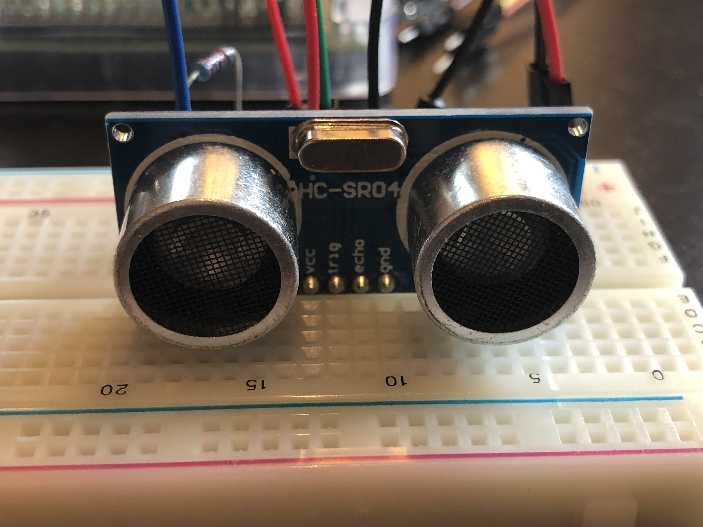
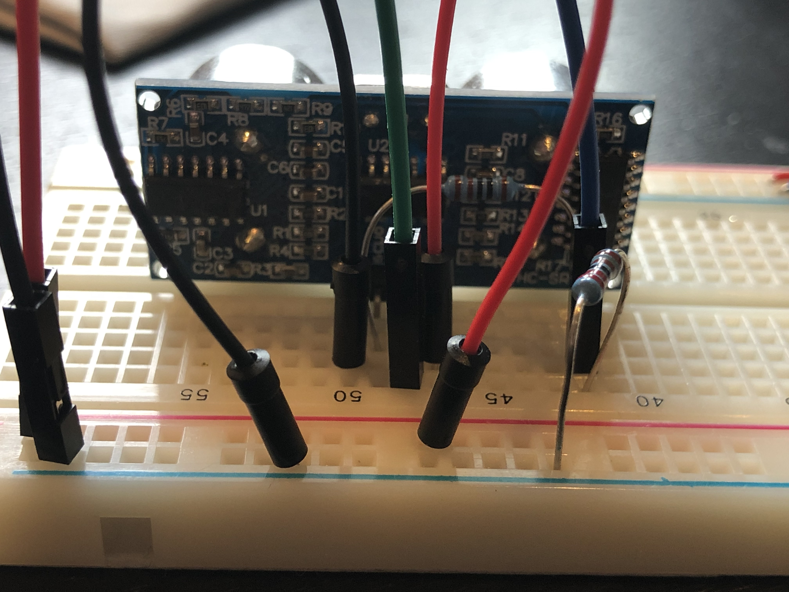
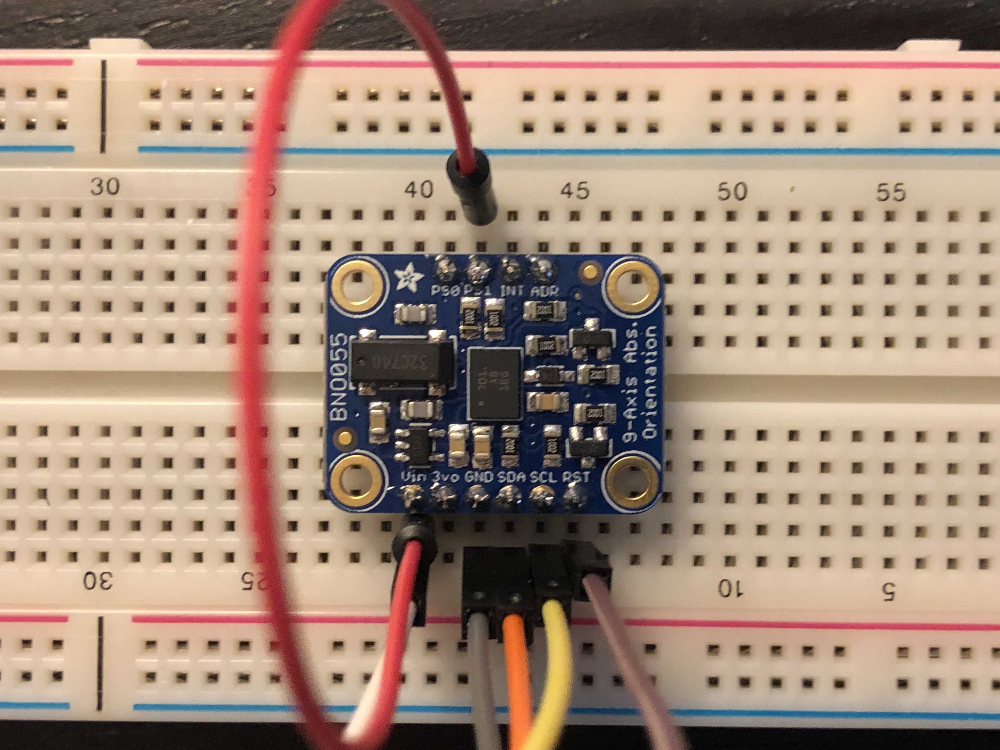
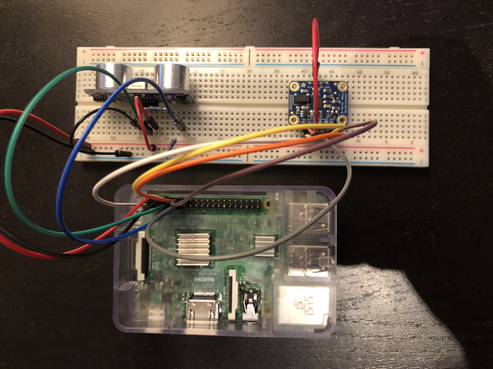

# Overview

CMSC 818W group project to develop an equivalent probing stick for the blind using basic IMU and distance ranging sensors.

Our approach is to leverage ultrasonic distance ranging and inertial measurement units (IMUs) to develop a new type of aid for the visually impaired.  Using ultrasound (sound waves with a frequency higher than humans can hear) we can determine the distance to physical objects that far outreach the typical probing cane length.  Using the accelerometers,  gyroscopes, and magnetometers within IMUs, we can determine our exact orientation and to an extent our velocity and position.  Combined, we attempt to create a three dimensional representation of the surroundings so that we can provide insight to the blind user. As part of a special opportunity at the University of Maryland, we also invested resources to build a website for real-time evaluation of our system for demonstration purposes.

# Setup

To execute the code, you will need to reproduce the hardware setup using a breadboard, resistors, and patch cables.  A review of the Raspberry Pi pinout can be found at [https://pinout.xyz/](https://pinout.xyz/).  Note that our code refers to the BCM (Broadcom) pin numbering system which is different from the “board” pin numbering system.  

| HC-SR04 Wiring | HC-SR04 Wiring |
| :------------- | :------------- |
|||

| BNO055 Wiring | System |
| :------------- | :------------- |
|||

# Starting The Codebase

You merely need to clone the repository to a Raspberry Pi 3, install the [https://github.com/adafruit/Adafruit_Python_BNO055](https://github.com/adafruit/Adafruit_Python_BNO055) package, and then execute `python3 driver.py` to start the service.  The remaining dependencies should already be included on a standard Raspberry Pi/Raspbian OS.

# Notebook Analysis

A number of [notebooks](https://github.com/looselycoupled/tiresias/tree/master/notebooks) have been provided which analyze the data files produced by the codebase.  After installiing the dependencies with `pip install -r requirements.txt` you can start the jupyter server with `jupyter notebook notebooks/` within the project root folder.
